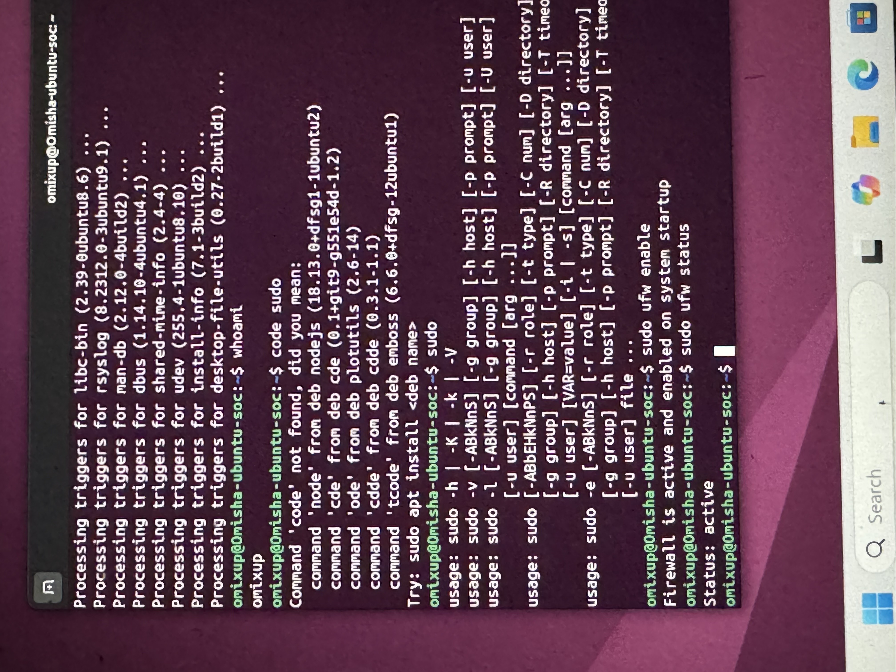
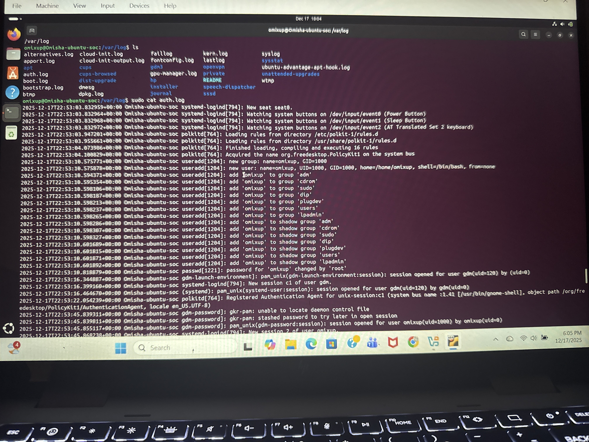
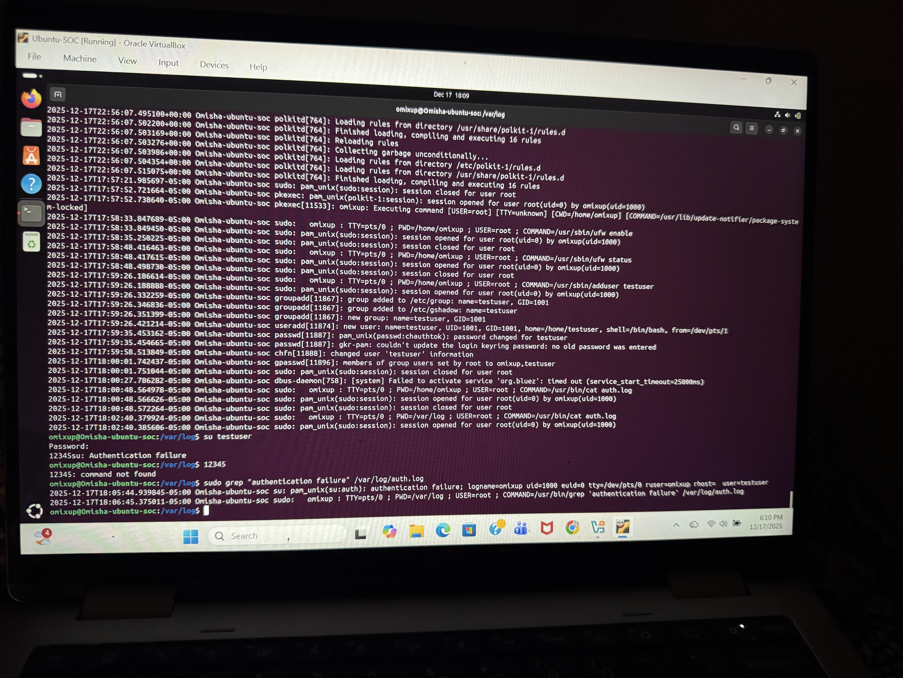

**Linux SOC Cybersecurity Lab (Ubuntu)**

Project Overview
This project shows how I built a Linux-based SOC lab using Ubuntu. The goal of this lab was to practice basic cybersecurity skills such as system hardening, user management, log monitoring, and detecting unauthorized login attempts.

Objectives
- Build an Ubuntu Linux virtual machine
- Secure the system using updates and firewall
- Manage users using least-privilege principles
- Monitor authentication logs
- Simulate and detect failed login attempts

Technologies Used
- Ubuntu Linux
- Oracle VirtualBox
- Linux Terminal (Bash)
- UFW Firewall
- Authentication Logs (auth.log)

Lab Environment
- Host OS: Windows
- Guest OS: Ubuntu Linux
- Virtualization: Oracle VirtualBox

System Hardening
sudo apt update
sudo apt upgrade -y

Firewall Configuration
sudo ufw enable
sudo ufw status

User Management
sudo adduser testuser
id testuser

Log Monitoring
cd /var/log
sudo cat auth.log

Attack Simulation
su testuser
(entered wrong password multiple times)

Attack Detection
sudo grep "authentication failure" /var/log/auth.log

Project Outcome
- Successfully built and secured an Ubuntu Linux system
- Enabled firewall protection
- Created and managed users securely
- Detected failed login attempts using log analysis
- Gained hands-on SOC analyst experience

Skills Demonstrated
- Linux fundamentals
- System hardening
- User access control
- Security monitoring
- Log analysis
- Incident detection

Screenshots

Firewall Enabled (UFW)

Authentication Log Review

Failed Login Attempt Detection
 

